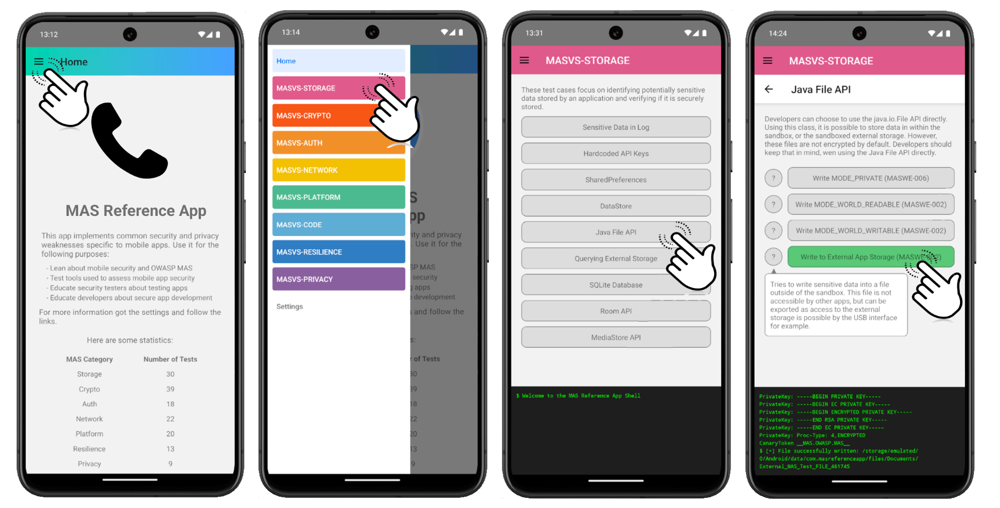

# Introduction



The MAS Reference App is an mobile application which implements common mobile security weaknesses, but also defense-in-depth techniques categorized under the MAS framework.

You can use the application to ...

1. test and develop tools used to test mobile application security
2. learn about secure mobile app development
3. learn about testing mobile apps

The first use case was the primary driver for this app so far, as we wanted to have an app which interacts insecurely with the OS API or which implements common defense-in-depth techniques. For this use case the app can be used as target for security tool such as static or dynamic vulnerability detection.

We recommend using the app only on dedicated test devices, as some of the tests store data on the different locations which are not automatically removed afterwards, while others try to access personal information. However, these information are not processed in any form. 

>**Note**: This project is not officially associated with the OWASP MAS project. However, we welcome everybody to use and share code and test cases from this project.


# Getting Started

## Step 0: Download dependencies

After you downloaded the code, you need to install the node dependencies:

```bash
# using npm
npm install

# OR using Yarn
yarn install
```


## Step 1: Start the Metro Server

Then, you will need to start **Metro**, the JavaScript _bundler_ that ships _with_ React Native.

To start Metro, run the following command from the _root_ of your React Native project:

```bash
# using npm
npm start

# OR using Yarn
yarn start
```

## Step 2: Start your Application

Let Metro Bundler run in its _own_ terminal. Open a _new_ terminal from the _root_ of your React Native project. Run the following command to start your _Android_ or _iOS_ app:

### For Android

```bash
# using npm
npm run android

# OR using Yarn
yarn android
```

### For iOS

```bash
# using npm
npm run ios

# OR using Yarn
yarn ios
```

>**Note**: At the moment, only Android is supported. While it is possible to build the app for iOS, no test cases are implemented yet.

If everything is set up _correctly_, you should see your new app running in your _Android Emulator_ or _iOS Simulator_ shortly provided you have set up your emulator/simulator correctly.

This is one way to run your app — you can also run it directly from within Android Studio and Xcode respectively.

## Step 3: Set up Server

Some of the tests establish connections to remote servers. The following endpoints are needed for that:


| Endpoint                           | Description |
| ---------------------------------- | ------------------------------------------- |
| `http://<testDomain>`              |  Default HTTP                               |                      
| `https://<testDomain>`             |  Default HTTPS                              |
| `http://<testDomain>:3001`         |  HTTP on Non-Default Port                   |
| `https://invalidpin.<testDomain>`  |  Domain to test wrongly pinned certificates | 
| `ws://<testDomain>:2001`           |  WebSocket                                  |
| `<testDomain>:4001`                |  Raw UDP (echos the requests)               |
| `<testDomain>:5001`                |  Raw TPC (echos the requests)               |


By default, the domain `mas-reference-app.org` is used and the server should be up an running. However, you can set up your own server by using the project you find in the `./server/` folder. Simply follow the instructions there to set up the server.

Then you need to change the default domain in the apps setting:


# Canary Token

The insecure storage or processing of data is major risk in mobile app security. For example, it should not be that a login password is stored in plain text. If a tester now wants to develop a tool which scans the app or the sandbox at runtime for sensitive data, we should should know what is sensitive data in the MAS Reference App. 

The canary token solves this problem. With that, you can tell your scanner _this is sensitive data_ which should not be stored in plain text on the phone, or send to a remote server insecurely. Various tests then append the token to a set of other sensitive data, such as API keys or private keys, and use it accordingly.


# Writing your own Test Case

You can easily extend the test cases or add new ones. The MAS Reference App is built using React Native for its cross-platform interface, while security tests are implemented in native Java, Kotlin, Objective-C, or Swift.

If you want to add a new test, start by adding the test to the GUI. You can do that in the following three files:

1. `./src/tests/general.tsx`
2. `./src/tests/android.tsx`
3. `./src/tests/ios.tsx`

Tests which are relevant for both platforms are described in the first one, the others are for platform depended cases.

The type of the tests are as following:

```typescript
type MASCategory = {
  key: string;
  color: string;
  description: string;
  tests: TestGroup[];
};

type TestGroup = {
  title: string;
  description: string;
  testCases: TestCase[];
  maswe?: string;
};

type TestCase = {
  title: string;
  description?: string;
  nativeFunction: any;
  maswe?: string;
};
```

Based on this structure it should be straight forward to add a new test.

Secondly you must implement the native code. At the moment, we rely on the legacy bridged mode of React Native. However, the goal is to move the project to the new architecture in the future.

Go to [Android Native Modules](https://reactnative.dev/docs/legacy/native-modules-android) and [iOS Native Modules](https://reactnative.dev/docs/legacy/native-modules-ios) for more information about how to implement native code for the moment. 


# Limitations and Future Work

Finally, it should be discussed what the MAS Reference App is not at the moment and what we plan to do in the future:

- At the moment, we use legacy React Native with the JavaScript Bridge. We want to migrate the app to the new architere in the future.
- The app should not be used as a sole reference for developers in any way and no code from the MAS Reference app should be copy / pasted into any project because it is not production-ready or properly tested.
- You may have noticed that all the examples are from the Android version. The reason for that, is that only these use cases have been implemented so far. In fact, the next iteration will focus on the iOS app.
- Some of the use cases create files in public locations which are (deliberately) not deleted. Some of them remain on the phone even after the app has been uninstalled. It is therefore recommend using it on test devices only.
- During the development of this app, OWASP MAS published tests and demos. While the purpose of the MAS Reference App is a bit different, there is an overlap in test cases. At the moment, we also look into how we can share the code base of the tests with the project.
- Test automation could be implemented using a local server on the mobile app which exposes an API to start the tests. The app could therefore be integrated into a CI/CD pipeline and security tools could test against the app in an automated way.
- It is not a Crackme yet. However, the moment, we are developing a capture the flag challenge which can be used to test the users knowledge by applying techniques from the different MAS domains.


# Troubleshooting

Sometimes issues with caching, icon databases or dependencies can occur. Cleaning the project can help in some cases:

```bash
# clean Android Project
cd android
./gradlew clean
```

```bash
# clean React Native Project
watchman watch-del-all
yarn start --reset-cache
```
