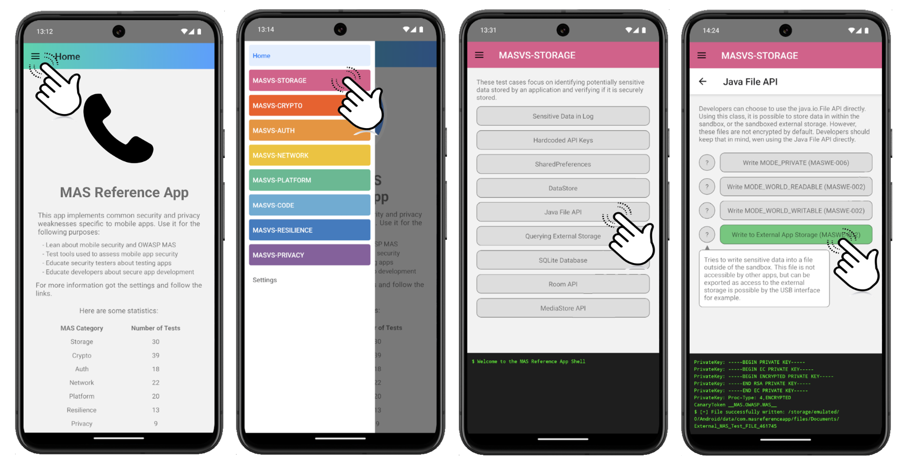

# Introduction



MAS Reference App


# Getting Started

>**Note**: This project is not officially associated with the OWASP MAS project. However, we welcome everybody to use and share code and test cases from this project.


## Step 1: Start the Metro Server

First, you will need to start **Metro**, the JavaScript _bundler_ that ships _with_ React Native.

To start Metro, run the following command from the _root_ of your React Native project:

```bash
# using npm
npm start

# OR using Yarn
yarn start
```

## Step 2: Start your Application

Let Metro Bundler run in its _own_ terminal. Open a _new_ terminal from the _root_ of your React Native project. Run the following command to start your _Android_ or _iOS_ app:

### For Android

```bash
# using npm
npm run android

# OR using Yarn
yarn android
```

### For iOS

```bash
# using npm
npm run ios

# OR using Yarn
yarn ios
```

>**Note**: At the moment, only Android is supported. While it is possible to build the app for iOS, no test cases are implemented yet.

If everything is set up _correctly_, you should see your new app running in your _Android Emulator_ or _iOS Simulator_ shortly provided you have set up your emulator/simulator correctly.

This is one way to run your app — you can also run it directly from within Android Studio and Xcode respectively.

## Step 3: Set up Server


# Writing your own Test Case


# Future Work


# Troubleshooting

Sometimes issues with caching, icon databases or dependencies can occur. Cleaning the project can help in some cases:

```bash
# clean Android Project
cd android
./gradlew clean
```

```bash
# clean iOS Project
xcodebuild clean
cd ios
pod deintegrate
pod install
```

```bash
# clean React Native Project
watchman watch-del-all
yarn start --reset-cache
```
